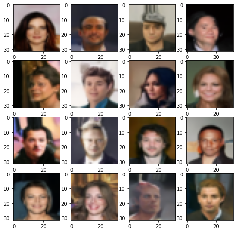
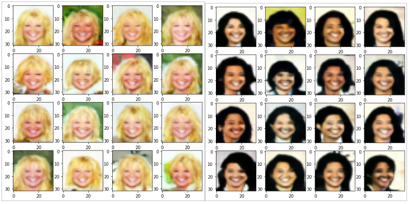

# Guided Diffusion

A collection of notebooks used to train a diffusion model on celeba dataset. 

```
Conditional Model can be trained and run using the conditional_celeba.ipynb notebook. 
```

## Random faces generated with a non conditional model. 



## Faces generated with a conditional model

Here we see faces generated displaying blonde and black hair. 


